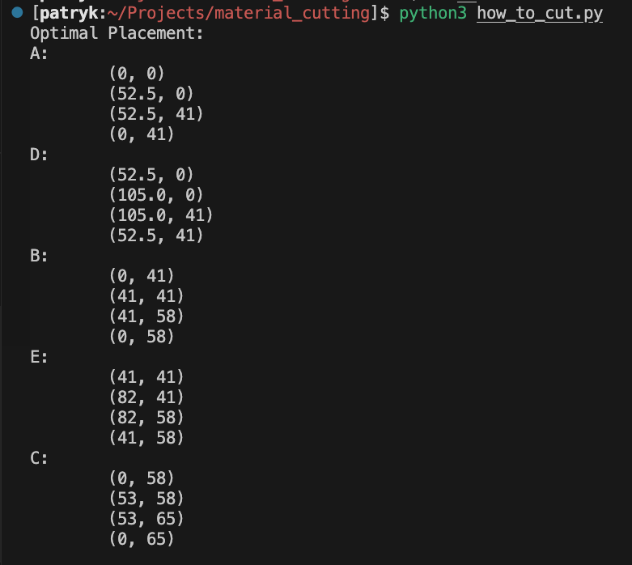
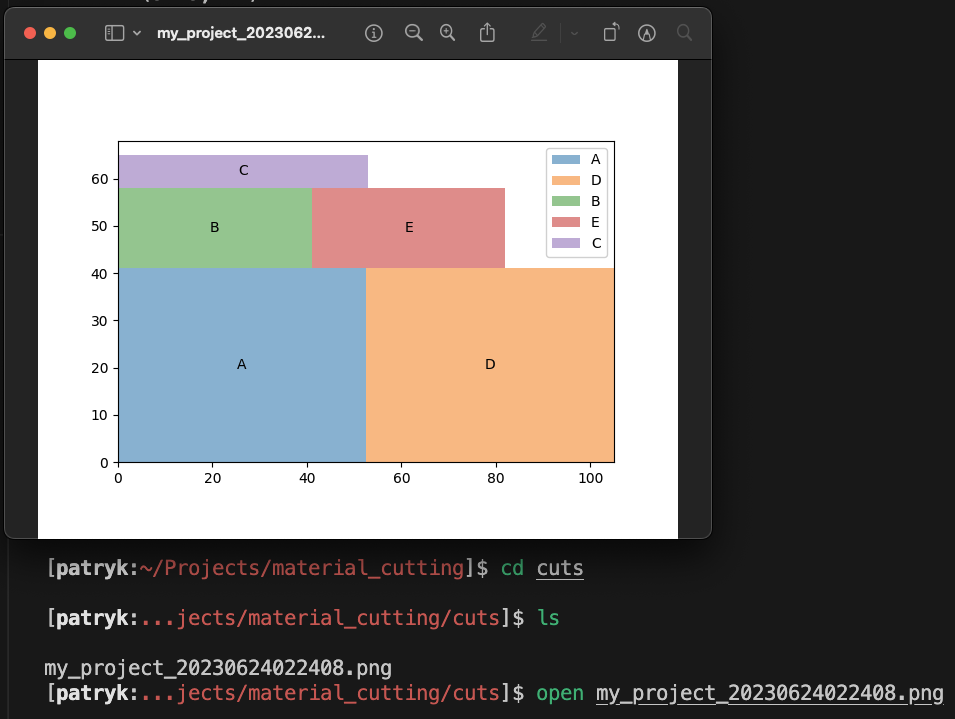

# Cutting edge planner
## Problem 
Passion for sewing leave you with a lot of offcuts which could be turned into something nice. Drawing and planning the cuts it is not as much fun as making new clothes. This app will help you check if your project fits the material and will suggest how to place the cuts. 

## Assumptions
1. Only rectangles are currently supported 
2. No margin is added to the dimenssions (If you need one add it to the initial dimensions - might add an ofset option later)

## What it does
Program will return the coordinates of each cut as text like below

<p align="center">
  
</p>

and will save a graphic with the cut placement.

<p align="center">
  
</p>

## How do I use it
Pre reqs - Python (tested on 3.9)
Install requerements with
```bash
pip install -r requirements.txt
```

Define the project in `input.json` file:
```json
{
  "project_name": "my_project",
  "material_dimensions": [105, 68],
  "cut_dimensions": {
    "A": [52.5, 41],
    "B": [41, 17],
    "C": [53, 7],
    "D": [52.5, 41],
    "E": [41, 17]
  }
}

```

Run the program from the repo directory with 
```bash
python how_to_cut.py
```